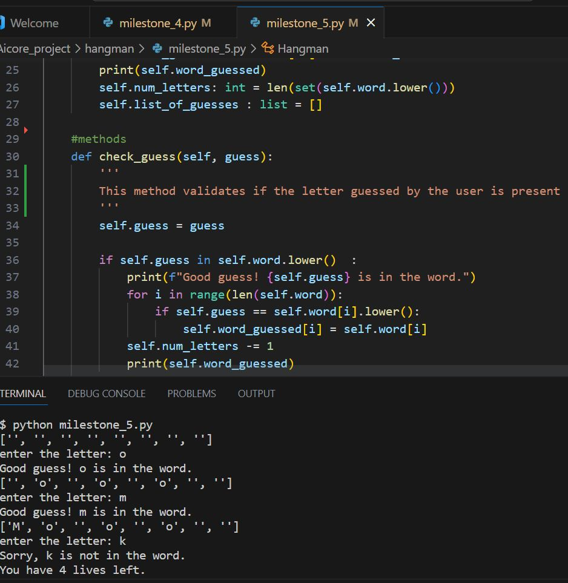
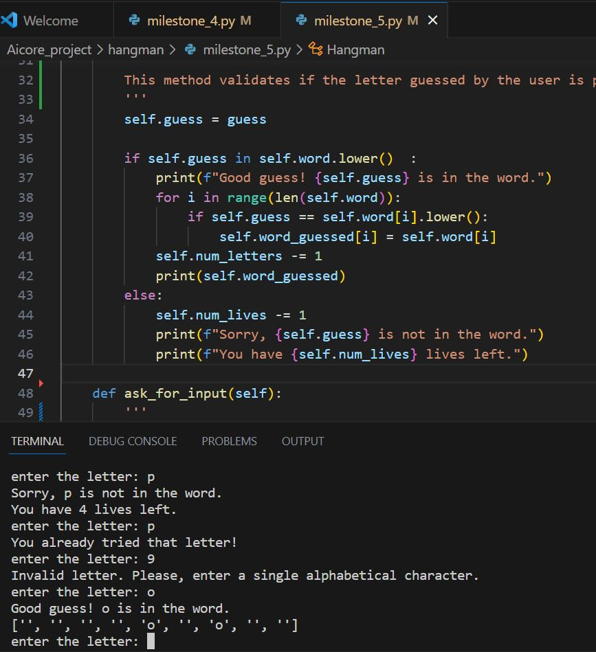

# Hangman
Hangman is a classic game in which a player thinks of a word and the other player tries to guess that word within a certain amount of attempts.

This is an implementation of the Hangman game, where the computer thinks of a word and the user tries to guess it. 

# **Hangman project**

## **Milestone2** 

- **Task1:** 
    - In this task define a list of possible words(favourite fruits) and print it.
    
- **Task 2:**    
    - In this task implement the functionality of random choice by importing the random library and using random.choice method.
    - print the random word from the list using above method.

- **Task 3:** 
    - In this task take the user input using input functionality 
    - Take any letter as input and print it.

- **Task 4:**
    - Validation of the input using If and else functionality for valid input of letter and length of the input as 1.
    - Valid message to be displayed for the inputs provided to the user.

## **Milestone 3** 

- **Task 1:**
    - In this task, create a WHILE loop to ask the user to guess a letter and to check if it is single alphabetical character. 
    - To break the loop if passes the check, otherwise ask the user to try again.
    
- **Task 2:**
    - In this task, to check if the random word generated in Milestone_2 contains the letter given in the user input. 

- **Task 3:**
    - In this task, create functions for above blocks.
        - **_check_guess_** : function will take the guessed letter as an argument and check if the letter is in the word.
        - **_ask_for_input_** : function will check for valid input and within this function will call check_guess.  

## **Milestone 4** 

- **Task 1:**
    - In this task we create a _class_ **'Hangman'**, in which we define the init method to intialise the attributes. _word_list_ and _num_lives_ are two parameters passed within class. By default set num_lives as 5.
    - Initialise instance attributes within init:
        1. word: The word to be guessed, picked randomly from the word_list. Remember to import the random module into your script.

        2. word_guessed: list - A list of the letters of the word, with for each letter not yet guessed. For example, if the word is 'apple', the word_guessed list would be ['', '', '', '', '']. If the player guesses 'a', the list would be ['a', '', '', '', ''].

        3. num_letters: int - The number of UNIQUE letters in the word that have not been guessed yet.

        4. num_lives: int - The number of lives the player has at the start of the game.

        5. word_list: list - A list of words.

        6. list_of_guesses: list - A list of the guesses that have already been tried. Set this to an empty list initially. 

-  **Task 2:**
    - In this task, we craete __check_guess_ method to check the input letter provided by the user is within the randomly selected word, if it is minus the num_letter by 1 and if it is to print the valid message and if not to decrease the num_lives by 1. 
    - In step 2, we create the function _ask_for_input_ with the help of while loop, we ask the user to guess the word and to validate if the guessed letter is single alphabetical character. And check for repetition of the letter. If the condition satisfies for single alphabetical character call the method _check_guess_

- **Task 3:**
    - In this task we define few conditions to replace the correct guessed letters by the user in the word_guessed variable. 
- **Task 4:**
    - In this task, we define the condition if the letter guessed by the user is not in the word and if not num_lives reduced by 1 with default messages.

## **Milestone 5** 
- **Task 1:**
    - In this task, we create a function that will run the game as expected. We create a _play_game_ function with the conditions and parameters inside which we call the _hangman_ class.
    - 
    - 
    - 
    - 
      

    
